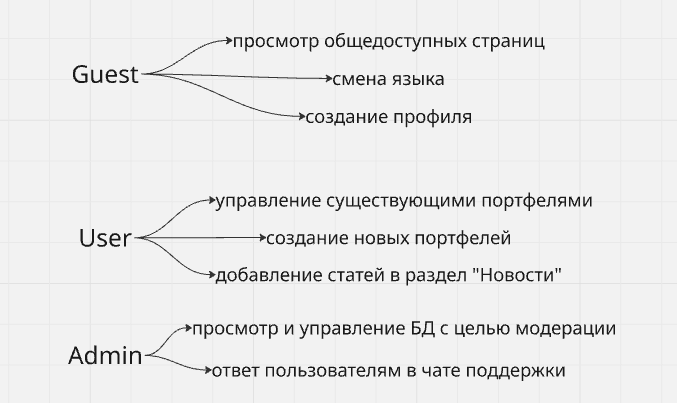
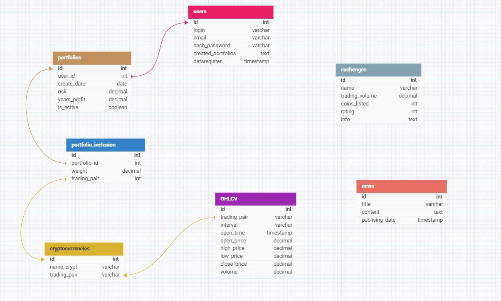

# OptFinance

## Описание проекта

Видение проекта заключается в создании современного веб-сервиса для анализа и формирования криптовалютного портфеля, позволяющего пользователю выбирать уровень риска и доходности и получать прогноз по доходности и убыткам. Сервис обеспечивает хранение данных пользователей и исторических котировок криптовалют, предоставляет информацию о монетах, позволяет анализировать и корректировать портфель, а также включает адаптивный интерфейс для различных устройств, поддержку двух языков и встроенный чат для взаимодействия с поддержкой.

## Стек технологий

- Core: Python, Django
- Solvers: HiGHS (MILP, QP), SCIP (MIQP, MINLP)
- Tools: Python or Julia- scripts, C++ - algorithms, C - performance improvement, python - ML
 
## Роли пользователей

- Guest - базовое использование сайта, просмотр общедоступных страниц, смена языка, создание профиля
- User - управление существующими портфелями, создание новых портфелей, добавление статей в раздел "Новости"
- Admin - просмотр и управление БД с целью модерации, ответ пользователям в чате поддержки

## Схема БД

## API

- get_user_info - используется для просмотра информации о пользователе
- change_user_info - используется для внутренних нужд (создание профилей, изменение данных)
- save_message - используется для сохранения сообщений из чата поддержки с определенным пользователем
- get_portfolio_info - используется для получения детальной информации по заданному портфелю 
- change_portfolio_info - используется для получения детальной информации по заданному портфелю 
- get_crypto_info - используется для получения внутренней информации о выбранном токене
- set_crypto_info - используется для задания внутренней информации о выбранном токене

## Swagger

Crypto Platform API
Это API для регистрации, аутентификации и работы с криптовалютами, биржами и новостями.
Как использовать Swagger UI
Swagger UI предоставляет интерактивную документацию для этого API, позволяя вам просматривать доступные эндпоинты, их параметры и возможные ответы, а также тестировать их прямо из браузера.
Доступ к Swagger UI
Вы можете получить доступ к Swagger UI, перейдя по следующему URL в вашем браузере:
http://localhost:8000/swagger?format=openapi
Навигация по документации
После открытия Swagger UI вы увидите список категорий (тегов), таких как cryptocurrencies, exchanges, news и registration. Каждая категория содержит список доступных эндпоинтов.
Нажмите на любой эндпоинт, чтобы развернуть его и увидеть подробную информацию:
HTTP метод: (GET, POST, PUT, PATCH, DELETE)
Путь: URL эндпоинта.
Описание: Краткое описание функциональности эндпоинта.
Параметры: Все входные параметры, необходимые для запроса (путь, запрос, тело).
Ответы: Возможные коды состояния HTTP и форматы ответов.
Аутентификация
Некоторые эндпоинты требуют аутентификации. Вы можете авторизоваться, используя кнопку "Authorize" в правом верхнем углу страницы.
Нажмите кнопку "Authorize".
В появившемся диалоговом окне выберите метод аутентификации (например, Bearer Token).
Введите ваш токен доступа в соответствующее поле (например, Bearer <YOUR_ACCESS_TOKEN>).
Нажмите "Authorize", затем "Close".
После успешной авторизации, замки рядом с защищенными эндпоинтами изменятся на закрытые.
Тестирование эндпоинтов
Вы можете протестировать любой эндпоинт прямо из Swagger UI:
Разверните эндпоинт, который вы хотите протестировать.
Нажмите кнопку "Try it out".
Если эндпоинт требует параметры, введите их в соответствующие поля.
Для параметров пути (например, {coin_id}) введите значение непосредственно в поле.
Для параметров запроса (query parameters) введите значения в соответствующие поля.
Для тела запроса (request body) вы можете отредактировать предоставленный пример JSON.
Нажмите кнопку "Execute".
Вы увидите "Curl" команду, URL запроса, код ответа, тело ответа и заголовки ответа.

Описание API Эндпоинтов
Cryptocurrencies
GET /cryptocurrencies/
Получить список всех доступных криптовалют.
GET /cryptocurrencies/{coin_id}/
Получить информацию о конкретной криптовалюте по её ID.
Exchanges
GET /exchanges/
Получить список всех доступных бирж.
GET /exchanges/{exchange_id}/
Получить информацию о конкретной бирже по её ID.
News
GET /news/
Получить список всех новостей.
POST /news/create/
Создать новую новость. Требуется аутентификация.
GET /news/{news_id}/
Получить информацию о конкретной новости по её ID.
PUT /news/{news_id}/update/
Полностью обновить существующую новость по её ID. Требуется аутентификация.
PATCH /news/{news_id}/update/
Частично обновить существующую новость по её ID. Требуется аутентификация.
Registration (Аутентификация и Управление Пользователями)
POST /registration/auth/login/
Авторизовать пользователя и получить токены доступа/обновления.
POST /registration/auth/logout/
Выйти из системы (отозвать токены). Требуется аутентификация.
GET /registration/auth/profile/
Получить профиль текущего аутентифицированного пользователя. Требуется аутентификация.
POST /registration/auth/refresh/
Обновить токены доступа с помощью токена обновления.
POST /registration/auth/register/
Зарегистрировать нового пользователя.
POST /registration/chat/send/
Отправить сообщение в чат. Требуется аутентификация.
GET /registration/users/{user_id}/
Получить информацию о конкретном пользователе по его ID. Требуется аутентификация.
DELETE /registration/users/{user_id}/delete/
Удалить пользователя по его ID. Требуется аутентификация.
POST /registration/users/{user_id}/update/
Обновить информацию о пользователе по его ID. Требуется аутентификация.
=======
## Сетевое взаимодействие Клиента и Сервера

Ниже описано, как организовано и запускается сетевое взаимодействие между фронтендом (Vite/React) и бэкендом (Django REST + Channels).

### Что уже есть
- Бэкенд (Django) поднимает REST‑эндпоинты:
  - `GET /news/` — список новостей
  - `GET /exchanges/` — список бирж
  - `GET /cryptocurrencies/` — список криптовалют
  - `POST /registration/auth/login/`, `POST /registration/auth/register/`, и др. — аутентификация
- Включён CORS: фронтенд может обращаться к API с другого порта/домена.
- Поддержка WebSocket через Django Channels подключена для модуля `registration` (чат), но на фронтенде можно подключать позже.

### Как запустить локально
1) Бэкенд (Django):
- Перейдите в директорию `optfin/`
- Убедитесь, что у вас настроены переменные окружения (см. `optfin/MainProject/settings.py` ожидает `.env`)
- Установите зависимости: `pip install -r requirements.txt`
- Выполните миграции: `python manage.py migrate`
- Запустите сервер: `python manage.py runserver 0.0.0.0:8000`

2) Фронтенд (Vite/React):
- Выберите один из фронтов. В примере используется `Optfinance-news 2/`
- Перейдите в директорию `Optfinance-news 2/`
- Установите зависимости: `npm install`
- (Опционально) Создайте файл `.env` и укажите адрес API, например:
  - `VITE_API_BASE=http://localhost:8000`
- Запустите dev‑сервер: `npm run dev`

Теперь фронтенд (порт 5173 по умолчанию у Vite) может обращаться к бэкенду на `http://localhost:8000`.

### Как фронтенд обращается к API
Во фронтенде добавлен вызов REST из файла `Optfinance-news 2/index.tsx`. Он запрашивает:
- `GET {VITE_API_BASE}/news/` → отрисовывает карточки новостей
- `GET {VITE_API_BASE}/exchanges/` → таблица бирж
- `GET {VITE_API_BASE}/cryptocurrencies/` → таблица монет

Если переменная `VITE_API_BASE` не задана, используется `http://localhost:8000` по умолчанию.

### Базовые принципы выбранного метода
- REST: клиент делает HTTP‑запросы (`GET`, `POST`, и т.д.) к URL‑ресурсам сервера и получает JSON. Это просто, прозрачно, кэшируемо и хорошо поддерживается инструментами.
- CORS: механизм браузера, разрешающий фронтенду на одном домене/порту вызывать API на другом. В проекте включён `corsheaders`, и разрешён доступ для локальной разработки.
- WebSocket (реалтайм): проект настроен на работу через ASGI/Channels и использует middleware для JWT‑аутентификации в веб‑сокетах. Это удобно для чатов и уведомлений. При необходимости фронтенд может подключиться к `ws://<host>/...` маршрутам из `registration.routing`.

### Частые проблемы и решения
- 403/CSRF при `POST` из браузера: для публичных `GET` проблем нет, для защищённых методов используйте JWT из `/registration/auth/login/` и передавайте `Authorization: Bearer <token>`.
- CORS ошибка в консоли: проверьте `CORS_ALLOWED_ORIGINS` или `CORS_ALLOW_ALL_ORIGINS=True` и корректность `VITE_API_BASE`.
- 404 при запросе: убедитесь, что URL совпадает с маршрутами из `optfin/MainProject/urls.py` и *app* `urls.py`.

## Swagger (документирование backend)

В проект добавлена авто‑документация API с помощью Swagger (drf‑yasg).

### Как запустить и открыть документацию
1) Запустите бэкенд (см. выше): `python manage.py runserver 0.0.0.0:8000`
2) Откройте в браузере:
- Swagger UI: `http://localhost:8000/swagger/`
- ReDoc: `http://localhost:8000/redoc/`
- Сырые схемы: `http://localhost:8000/swagger.json` или `http://localhost:8000/swagger.yaml`

### Что это даёт
- Просмотр всех доступных эндпоинтов, их параметров, кодов ответов и моделей данных.
- Тестирование запросов прямо из браузера (кнопка Try it out в Swagger UI).
- Автоматическое обновление схемы при добавлении/изменении вьюх.

### Аутентификация в Swagger UI
- Для защищённых эндпоинтов используйте JWT из логина `/registration/auth/login/`.
- В Swagger UI нажмите Authorize и вставьте токен как `Bearer <ваш_JWT>`.

### Технические детали
- Зависимость: `drf-yasg` добавлена в `optfin/requirements.txt`.
- Маршруты документации объявлены в `optfin/MainProject/urls.py`:
  - `/swagger/`, `/redoc/`, `/swagger.json`, `/swagger.yaml`.

### docker 
для бэкенда инструкция докера находится в файле readmeDocker.txt в проекте optfin, для фронтенда 
инструкция находится в файле readmeDockerFront.txt в папке frontend

